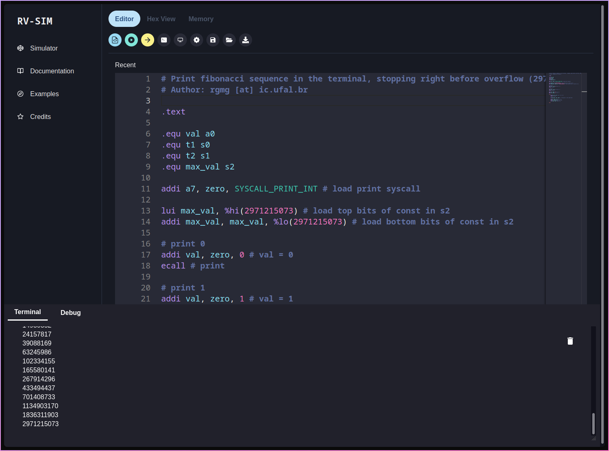
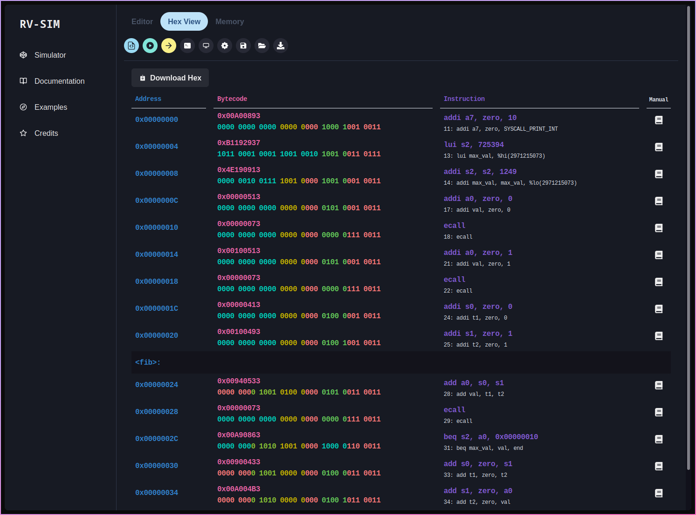
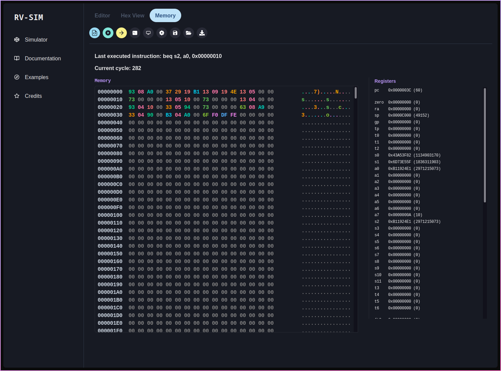

# RV-SIM

The very creatively named RV-SIM is a web-based educational RISC-V (RV32I/RV32M/RV32F) simulator with editor, stepping, memory inspection, syscalls, screen & keyboard I/O.

It is a fork of the [WIMS](https://github.com/ReinaldoAssis/mips-sim) web-based MIPS simulator created by [@ReinaldoAssis](https://github.com/ReinaldoAssis).

## Features

- [x] Built-in code editor
- [x] Step by step execution and debugging
- [x] I/O Output (screen and keyboard)
- [x] Terminal Output
- [x] User-friendly memory and register visualization
- [ ] Datapath visualization

## Supported extensions

- [x] RV32I (except fence)
- [x] RV32M
- [ ] RV32A
- [x] RV32F (except round mode)
- [ ] RV32D
- [ ] RV32Q
- [ ] RV32C
- [ ] CSRs

## Usage/Examples

This is the default code when you first open the editor, it computes the nth number of the fibonacci sequence. You can either press the green button to assemble and run or you can step through each instruction using the yellow button. The result is displayed in the terminal.

```assembly
.text

.equ val a0
.equ t1 s0
.equ t2 s1
.equ max_val s2

addi a7, zero, SYSCALL_PRINT_INT # load print syscall

lui max_val, %hi(2971215073) # load top bits of const in s2
addi max_val, max_val, %lo(2971215073) # load bottom bits of const in s2

# print 0
addi val, zero, 0 # val = 0
ecall # print

# print 1
addi val, zero, 1 # val = 1
ecall # print

addi t1, zero, 0 # t1 = 0
addi t2, zero, 1 # t2 = 1

fib:
    add val, t1, t2 # val = t1 + t2
    ecall # print

    beq max_val, val, end #  if (max_val == val) goto end

    add t1, zero, t2 # t1 = t2
    add t2, zero, val # t2 = val
    jal zero, fib # goto fib

end:
```

## Screenshots

Editor and terminal



Instruction Set



Memory inspector



## Authors

- [@reinaldoassis](https://www.github.com/reinaldoassis)
- [@rgalhos](https://www.github.com/rgalhos)
